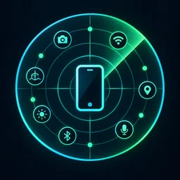

# Browser Sensor Lab

<p align="center">
  
</p>

ブラウザや端末がWebへ公開しているセンサー / ハードウェアAPIを診断する静的Webアプリです。

「対応APIだけを試すデモ」ではなく、**この端末 × このブラウザで何が見える／見えないか**を確認することを目的にしています。APIが存在しない場合も `ブラウザ非対応` として表示し、それ自体を診断結果として扱います。

基本方針は、**相手となる外部機器が不要なAPIは、存在確認だけで終わらせず可能な範囲で実データ取得まで試す**ことです。Bluetooth / USB / Serial / NFC / HID / MIDI / Gamepadなど、相手となる機器が必要なAPIは「APIの有無」と「実機で動作したか」を分けて扱います。

## 対象範囲

追加ライブラリやAIモデルで二次解析した結果ではなく、**ブラウザ / OS がWeb APIとして直接公開する端末能力**を診断対象にします。

### 本体センサー

- Geolocation
- DeviceOrientationEvent / DeviceMotionEvent
- Generic Sensor API
  - Accelerometer
  - LinearAccelerationSensor
  - GravitySensor
  - Gyroscope
  - Magnetometer
  - AbsoluteOrientationSensor
  - RelativeOrientationSensor
  - AmbientLightSensor
- Device Posture

### 端末能力

- Camera / Microphone
- MediaDevices.enumerateDevices()
- MediaStreamTrack.getSettings() / getCapabilities()
- Pointer / Touch / maxTouchPoints
- Screen / Screen Orientation
- Battery Status
- Network Information
- Hardware information
- Vibration
- Screen Wake Lock
- Speech Recognition
- Screen Capture

### 外部デバイスAPI

- Web Bluetooth
- WebUSB
- Web Serial
- Web NFC (NDEF)
- WebHID
- Gamepad API
- Web MIDI

### 対象外

MediaPipe、TensorFlow.js、ONNX Runtime Webなど、追加ライブラリやAIモデルを使ってカメラ映像やセンサーデータを二次解析して得る機能は対象外です。

## 表示の考え方

- **ブラウザ非対応**: APIの入口そのものが公開されていない
- **API対応・未確認**: APIの入口は存在するが、まだ実データ取得を試していない
- **データ待ち**: API開始には成功し、最初の実データを待っている
- **動作確認済**: 実データを1回以上取得できた
- **一部確認**: 複数対象のうち一部だけ実動作を確認できた
- **取得不可 / 取得エラー**: APIは存在するが、権限・HTTPS・Permissions Policy・OS制限・対象ハードウェア不足等で利用できない
- **API対応・実機必要**: APIは存在するが、動作確認に別の外部機器が必要

APIの存在と、実際にデータを取得できることは別物として扱います。

### カメラ / マイク実機診断

カメラとマイクは `getUserMedia()` で実際に一時起動し、取得できた `MediaStreamTrack` の `getSettings()` / `getCapabilities()` を表示したあと、診断用ストリームをすぐ停止します。片方だけ成功した場合は `一部確認` と表示します。

## ローカル実行

一部APIはHTTPSまたはlocalhostでのみ利用できます。

```bash
git clone https://github.com/shinp-dev/browser-sensors.git
cd browser-sensors
python3 -m http.server 8000
```

`http://localhost:8000/` をブラウザで開いてください。

## デプロイ

`main` へのpushまたはGitHub Actionsの手動実行で、既存のCloudflare PagesプロジェクトへDirect Uploadします。GitHub Pagesはデプロイ先として使用しません。

- Production: `https://sensors.shinp-studio.com/`
- Pages project: `browser-sensors`
- Repository secrets: `CLOUDFLARE_API_TOKEN`, `CLOUDFLARE_ACCOUNT_ID`
- 公開対象: `index.html`, `external.html`, `src/`, `assets/`

Cloudflare PagesプロジェクトとカスタムドメインはCloudflare側で管理し、workflowは既存プロジェクトへのデプロイだけを行います。

## プライバシー

カメラ映像・位置情報・センサー値を、このサイト独自のバックエンドへ保存・送信する処理はありません。

ただし以下には注意してください。

- Speech Recognition はブラウザ実装によって音声が外部の音声認識サービスへ送信される場合があります。
- ブラウザ / OS / Web API自身の実装による通信までは、このアプリから制御できません。

## ライセンス

MIT License
